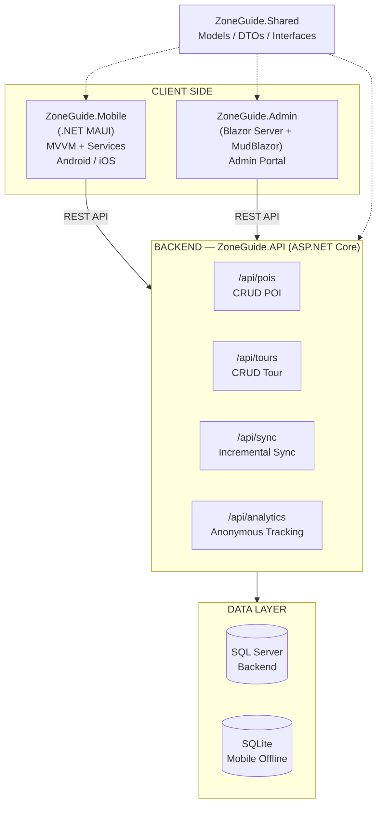
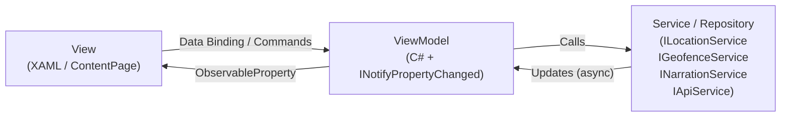
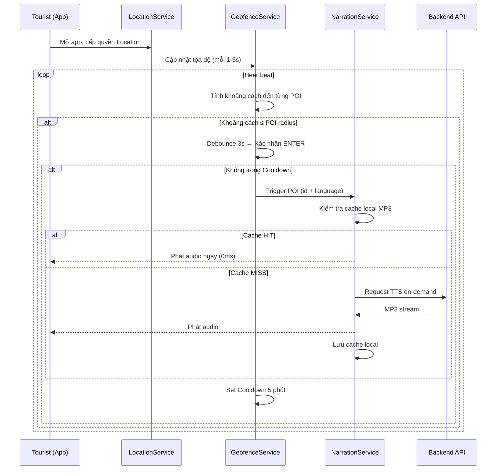
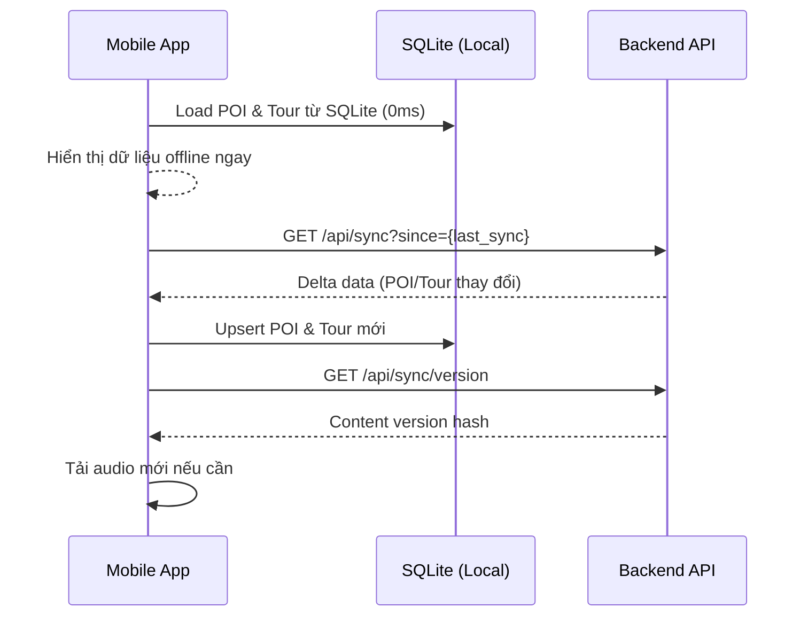
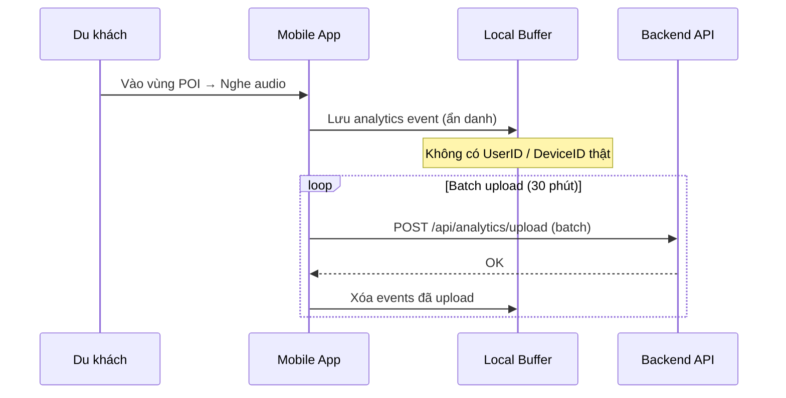
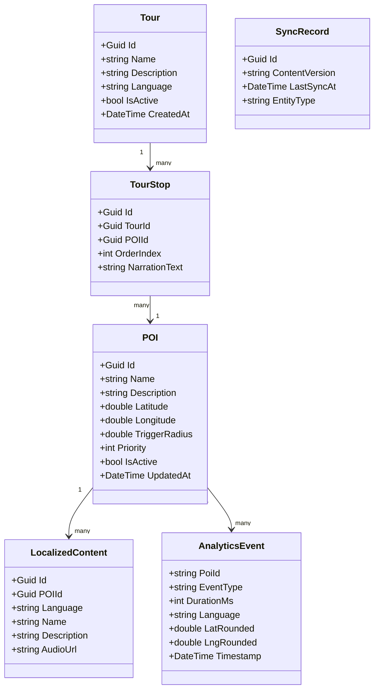
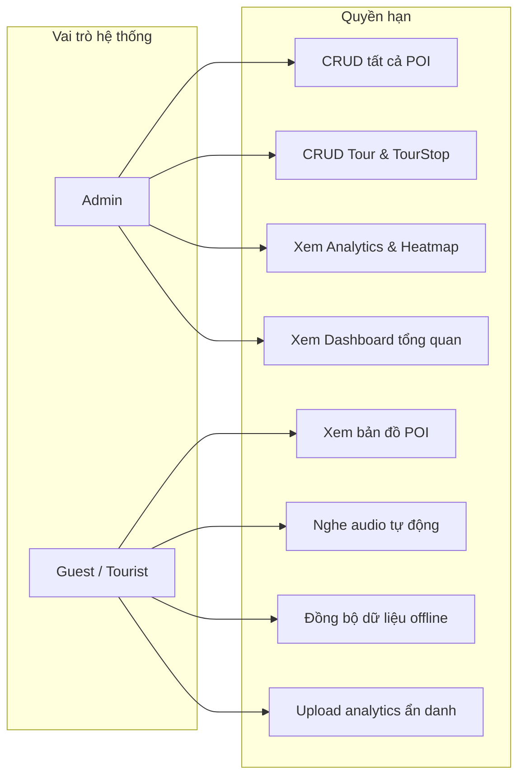
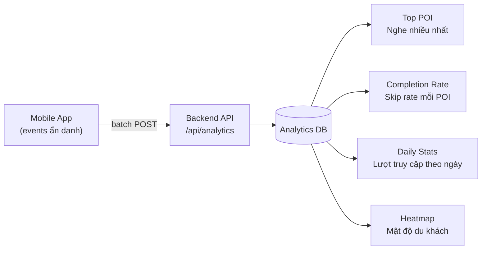

# ZoneGuide — Hệ Thống Thuyết Minh Du Lịch Dựa Trên GPS

 ### Yêu cầu
- .NET 8.0 SDK
- Visual Studio 2022 
- SQL Server 

---

## 1. Thành Viên

| # | Họ và tên | 
|---|---|
| 1 | Hồ Phạm Hữu Bình | 
| 2 | Nguyễn Văn Phát | 

---

## 2. Tổng Quan

Hệ thống thuyết minh du lịch tự động dựa trên GPS gồm 3 thành phần:

| Thành phần | Công nghệ | Mô tả |
|---|---|---|
| **Mobile App** | .NET MAUI | Du khách nghe audio tự động qua GPS + Geofencing, bản đồ tương tác, offline-first |
| **Admin Web** | Blazor Server + MudBlazor | Quản lý POI, tour, người dùng, analytics, dashboard |
| **Backend API** | ASP.NET Core | REST API, TTS, RBAC, đồng bộ offline |

---

## 3. Mục Tiêu 

**Mục tiêu chính:**
- POI có mô tả + ảnh + audio thuyết minh tự động khi du khách đi dạo trong khu vực POI.
- Hoạt động **100% offline** sau lần đồng bộ đầu tiên:  SQLite + audio cache local
- GPS + Geofencing tự động kích hoạt audio
- Hỗ trợ **đa ngôn ngữ** với TTS và file audio ghi sẵn.
- Chủ quán tự quản lý nội dung quán mình
- Dùng Edge-TTS và Google Translate miễn phí

---

## 4. Đối Tượng Người Dùng

| Persona | Nhu cầu chính |
|---|---|
| Du khách nội địa | Xem bản đồ POI, nghe thuyết minh tự động, khám phá tour theo lịch trình |
| Du khách quốc tế | Nghe audio bằng ngôn ngữ mẹ đẻ, xem ảnh minh họa, hiểu đặc trưng địa điểm |
| Quản trị viên (Admin) | CRUD POI & Tour, xem analytics, quản lý heatmap du khách |
| Chủ cửa hàng | CRUD POI, sửa thông tin cửa hàng |

---

## 5. Phạm Vi Tính Năng 

| Tính năng | Platform |
|---|---|
| Bản đồ tương tác hiển thị POI & vị trí người dùng | Mobile |
| GPS + Geofencing tự động kích hoạt audio narration | Mobile |
| Phát audio đa ngôn ngữ (TTS + pre-recorded) | Mobile |
| Hàng đợi audio (queue) với cơ chế chống trùng lặp | Mobile |
| Tải dữ liệu offline (SQLite + audio cache) | Mobile |
| Đồng bộ tăng dần (incremental sync) với backend | Mobile |
| Màn hình chi tiết POI (mô tả, ảnh, audio) | Mobile |
| Dashboard thống kê tổng quan | Web Admin |
| CRUD POI đa ngôn ngữ + hình ảnh | Web Admin |
| Quản lý Tour (sắp xếp POI theo thứ tự) | Web Admin |
| Analytics: Top POI, completion rate, daily stats | Web Admin |
| Heatmap mật độ du khách | Web Admin |
| REST API đồng bộ offline (incremental + full sync) | Backend |
| Anonymous analytics tracking | Backend |

**Ngoài phạm vi:** Push notification, thanh toán, chatbot.

### 5.1 Logic Geofencing & Audio Queue

Khi người dùng di chuyển vào vùng POI, app kích hoạt audio theo cơ chế ưu tiên:

```
GPS cập nhật tọa độ (mỗi 1–5 giây)
        ↓
┌────────────────────────────────────┐
│  Khoảng cách đến POI ≤ radius?     │
└────────────────────────────────────┘
        │ YES                  │ NO
        ▼                       ▼
  Debounce (3s)           Tiếp tục theo dõi
        ↓
  POI trong Cooldown?
        │ YES                  │ NO
        ▼                       ▼
  Bỏ qua               Thêm vào Audio Queue
                               ↓
                    Cache local có MP3?
                    │ HIT              │ MISS
                    ▼                   ▼
              Phát ngay (0ms)     TTS on-demand
                                  → Cache + Phát
```

**Cấu hình geofence:**
- `geofence_radius`: Cấu hình riêng cho từng POI
- `debounce`: 3 giây (tránh trigger khi di chuyển qua nhanh)
- `cooldown`: 300 giây (5 phút) — không phát lại cùng 1 POI quá sớm
- `priority queue`: POI gần nhất và có độ ưu tiên cao được phát trước

### 5.2 Logic Độ Chính Xác GPS Theo Pin

App tự động điều chỉnh độ chính xác GPS để tiết kiệm pin:

| Mức | Độ chính xác | Tiêu hao pin | Dùng khi |
|---|---|---|---|
| **Low** | ~500m | Rất thấp | Nền, tiết kiệm pin |
| **Medium** | ~100m | Trung bình | Duyệt bản đồ |
| **High** | ~10m | Cao | Navigation, geofencing |

### 5.3 Đồng Bộ Offline — Incremental Sync

```
Mobile App khởi động
        ↓
Load từ SQLite local → Hiển thị ngay (0ms)
        ↓
GET /api/sync?since={last_sync_time}
        ↓
┌────────────────────────────────────┐
│  Có dữ liệu mới?                   │
└────────────────────────────────────┘
        │ YES                  │ NO
        ▼                       ▼
  Upsert SQLite           Không thay đổi
  Tải audio mới           (dùng cache cũ)
  Cập nhật UI
```


---

## 6. Kiến Trúc Hệ Thống

### 6.1 System Architecture Overview



### 6.2 Cấu Trúc Solution

```
ZoneGuide/
├── src/
│   ├── ZoneGuide.Shared/          # Models, DTOs, Interfaces dùng chung
│   ├── ZoneGuide.Mobile/          # .NET MAUI — Android/iOS
│   ├── ZoneGuide.API/             # ASP.NET Core Web API
│   └── ZoneGuide.Admin/           # Blazor Server Admin Portal
├── scripts/                       # Build & deploy scripts (PowerShell)
├── .github/workflows/             # CI/CD GitHub Actions
├── ZoneGuide.sln
└── ZoneGuide.keystore             # Android signing key
```

### 6.3 MVVM Pattern (Mobile)



---

## 7. Luồng Nghiệp Vụ Chính

### 7.1 Geofencing → Audio Narration Flow



### 7.2 Offline Sync Flow



### 7.3 Analytics Upload Flow



---

## 8. Mô Hình Dữ Liệu



---

## 9. Phân Quyền & Bảo Mật



**Bảo mật dữ liệu:**
- Analytics **không lưu UserID / DeviceID** thật — chỉ anonymous device ID tạm thời.
- Tọa độ GPS được **làm tròn** (3 chữ số thập phân) trước khi gửi lên server.
- **Không thu thập thông tin cá nhân** — tuân thủ quy định quyền riêng tư.
- Yêu cầu **sự đồng ý của người dùng** trước khi theo dõi vị trí.

---

## 10. Technology Stack

| Layer | Công nghệ | Lý do |
|---|---|---|
| Mobile | .NET MAUI (.NET 8/10) | Cross-platform Android/iOS/Windows |
| Mobile UI | XAML + MAUI Controls | Native UI, MVVM data binding |
| Mobile DB | SQLite (sqlite-net-pcl) | Offline-first, nhẹ, hiệu năng cao |
| Admin Web | Blazor Server (.NET 8) | C# fullstack, real-time SSE |
| Admin UI | MudBlazor | Component library chuyên nghiệp |
| Backend | ASP.NET Core Web API | REST, Middleware, CORS |
| ORM | Entity Framework Core | Code-first, Migrations |
| Database | SQL Server (dev: SQLite) | Relational, ACID, Audit Log |
| Auth | JWT / Cookie | Bảo mật API và admin portal |

---

## 11. API Design

### POIs

| Endpoint | Method | Mô tả |
|---|---|---|
| `/api/pois` | GET | Danh sách tất cả POI |
| `/api/pois/{id}` | GET | Chi tiết 1 POI |
| `/api/pois/nearby` | GET | POI theo `lat`, `lon`, `radius` |
| `/api/pois` | POST | Tạo POI mới |
| `/api/pois/{id}` | PUT | Cập nhật POI |
| `/api/pois/{id}` | DELETE | Xóa POI |

### Tours

| Endpoint | Method | Mô tả |
|---|---|---|
| `/api/tours` | GET | Danh sách tour |
| `/api/tours/{id}` | GET | Chi tiết tour |
| `/api/tours/{id}/details` | GET | Tour kèm chi tiết POI |
| `/api/tours` | POST | Tạo tour |
| `/api/tours/{id}` | PUT | Cập nhật tour |
| `/api/tours/{id}` | DELETE | Xóa tour |

### Analytics

| Endpoint | Method | Mô tả |
|---|---|---|
| `/api/analytics/upload` | POST | Upload batch events ẩn danh |
| `/api/analytics/dashboard` | GET | Dashboard tổng hợp |
| `/api/analytics/top-pois` | GET | Top POI theo lượt nghe |
| `/api/analytics/heatmap` | GET | Dữ liệu heatmap (lat/lng clusters) |

---

## 13. Analytics & Dashboard

### 13.1 Thu Thập Dữ Liệu Ẩn Danh

App ghi lại các event **không chứa thông tin cá nhân** để phân tích hành vi du khách:

```csharp
// Event schema — không có user ID thật, không có device ID cố định
public class AnalyticsEvent
{
    public string   PoiId       { get; set; }  // "poi-guid-xxx"
    public string   EventType   { get; set; }  // "enter" | "play" | "skip" | "complete"
    public int      DurationMs  { get; set; }  // Thời gian nghe (ms)
    public string   Language    { get; set; }  // "vi-VN", "en-US"...
    public double   LatRounded  { get; set; }  // Làm tròn 3 chữ số (ẩn danh hóa)
    public double   LngRounded  { get; set; }
    public DateTime Timestamp   { get; set; }
}
```

### 13.2 Dashboard Admin (Blazor + MudBlazor)



| Metric | Mô tả | Dùng để |
|---|---|---|
| **Top POIs** | Điểm được nghe nhiều nhất 7/30 ngày | Ưu tiên cập nhật nội dung |
| **Completion rate** | Tỉ lệ nghe hết / bỏ giữa chừng | Đánh giá chất lượng audio |
| **Avg listen duration** | Thời gian nghe trung bình / POI | Tối ưu độ dài nội dung |
| **Daily trends** | Số lượt truy cập theo ngày/tuần | Lên kế hoạch vận hành |
| **Heatmap** | Mật độ du khách theo khu vực | Quyết định mở rộng POI |

---


