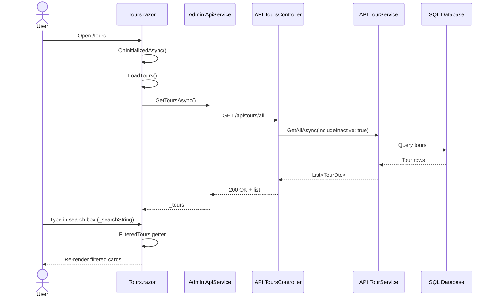
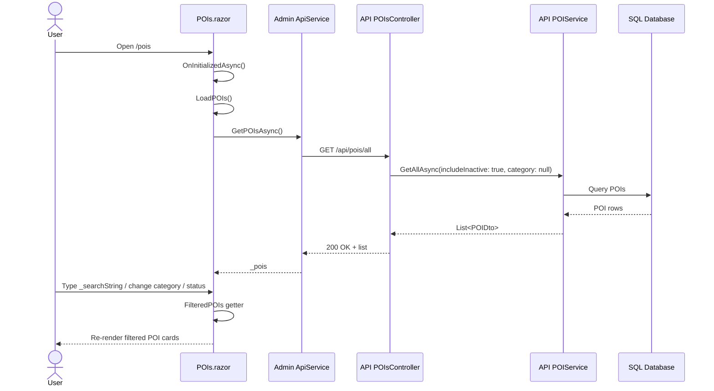
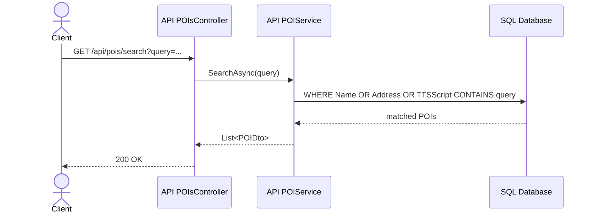
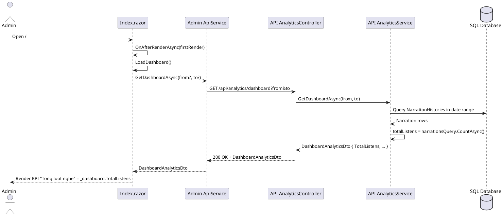

# Sequence Diagram -> Current Code Mapping

Tai lieu nay doi chieu cac sequence diagram trong anh voi code hien tai trong repository.

## Ket luan nhanh

- Hinh 1 dung ve huong luong, nhung dang gom 2 man hinh admin khac nhau: heatmap va realtime tracking.
- Hinh 2 dung voi code hien tai.
- Hinh 3 dung voi code hien tai.
- Hinh 4 dung ve y tuong, nhung co 2 nguon kich hoat `PlayImmediatelyAsync`: autoplay tu QR va geofence enter.
- Hinh 5 dung, va code hien tai chon POI theo `Priority + Distance + ContentReady + Popularity + Cooldown`.

## 1. Thong ke heatmap va tracking realtime (Admin)

### Heatmap

- `Heatmap.razor` goi `GetHeatmapDataAsync()` tai [src/ZoneGuide.Admin/Pages/Heatmap.razor](../src/ZoneGuide.Admin/Pages/Heatmap.razor#L188)
- `ApiService` goi API heatmap tai [src/ZoneGuide.Admin/Services/ApiService.cs](../src/ZoneGuide.Admin/Services/ApiService.cs#L412)
- `AnalyticsController` nhan request tai [src/ZoneGuide.API/Controllers/AnalyticsController.cs](../src/ZoneGuide.API/Controllers/AnalyticsController.cs#L87)
- `AnalyticsService` group du lieu tu `LocationHistories` thanh `HeatmapPointDto` tai [src/ZoneGuide.API/Services/AnalyticsService.cs](../src/ZoneGuide.API/Services/AnalyticsService.cs#L179)
- Y nghia: du lieu heatmap den tu lich su vi tri do mobile upload len API analytics.

### Realtime tracking

- `Index.razor` lay snapshot realtime tai [src/ZoneGuide.Admin/Pages/Index.razor](../src/ZoneGuide.Admin/Pages/Index.razor#L282)
- `ApiService` goi `GET api/mobile-monitoring/snapshot` tai [src/ZoneGuide.Admin/Services/ApiService.cs](../src/ZoneGuide.Admin/Services/ApiService.cs#L446)
- `MobileMonitoringController` tra snapshot tai [src/ZoneGuide.API/Controllers/MobileMonitoringController.cs](../src/ZoneGuide.API/Controllers/MobileMonitoringController.cs#L35)
- `MobileLiveMonitoringService` build snapshot tu `_sessions` tai [src/ZoneGuide.API/Services/MobileLiveMonitoringService.cs](../src/ZoneGuide.API/Services/MobileLiveMonitoringService.cs#L80)
- `MobileLiveMonitoringService` cap nhat session khi nhan heartbeat tai [src/ZoneGuide.API/Services/MobileLiveMonitoringService.cs](../src/ZoneGuide.API/Services/MobileLiveMonitoringService.cs#L49)
- `MobileLiveMonitoringService` broadcast thay doi qua SignalR tai [src/ZoneGuide.API/Services/MobileLiveMonitoringService.cs](../src/ZoneGuide.API/Services/MobileLiveMonitoringService.cs#L160)
- Mobile app bat dau gui heartbeat khi app mo tai [src/ZoneGuide.Mobile/App.xaml.cs](../src/ZoneGuide.Mobile/App.xaml.cs#L46) va [src/ZoneGuide.Mobile/Services/MobilePresenceService.cs](../src/ZoneGuide.Mobile/Services/MobilePresenceService.cs#L61)

## 2. Quet QR POI va tu phat audio

- Quet QR va doc payload o [src/ZoneGuide.Mobile/Views/QRScannerPage.xaml.cs](../src/ZoneGuide.Mobile/Views/QRScannerPage.xaml.cs#L114)
- Dieu huong sang map voi `poiId` va `autoplay=true` o [src/ZoneGuide.Mobile/Views/QRScannerPage.xaml.cs](../src/ZoneGuide.Mobile/Views/QRScannerPage.xaml.cs#L205)
- `MapPage` doc query `poiId` o [src/ZoneGuide.Mobile/Views/MapPage.xaml.cs](../src/ZoneGuide.Mobile/Views/MapPage.xaml.cs#L320)
- `MapPage` doc query `autoplay` o [src/ZoneGuide.Mobile/Views/MapPage.xaml.cs](../src/ZoneGuide.Mobile/Views/MapPage.xaml.cs#L326)
- `MapPage` kich autoplay sau khi focus POI o [src/ZoneGuide.Mobile/Views/MapPage.xaml.cs](../src/ZoneGuide.Mobile/Views/MapPage.xaml.cs#L257), [src/ZoneGuide.Mobile/Views/MapPage.xaml.cs](../src/ZoneGuide.Mobile/Views/MapPage.xaml.cs#L357), [src/ZoneGuide.Mobile/Views/MapPage.xaml.cs](../src/ZoneGuide.Mobile/Views/MapPage.xaml.cs#L391)
- `MapViewModel` tim POI va co the sync lai server o [src/ZoneGuide.Mobile/ViewModels/MapViewModel.cs](../src/ZoneGuide.Mobile/ViewModels/MapViewModel.cs#L845)
- `MapViewModel` goi `PlayImmediatelyAsync(BuildNarrationItem(...))` khi can phat ngay o [src/ZoneGuide.Mobile/ViewModels/MapViewModel.cs](../src/ZoneGuide.Mobile/ViewModels/MapViewModel.cs#L1439) va [src/ZoneGuide.Mobile/ViewModels/MapViewModel.cs](../src/ZoneGuide.Mobile/ViewModels/MapViewModel.cs#L1710)
- `NarrationService` nhan item vao queue o [src/ZoneGuide.Mobile/Services/NarrationService.cs](../src/ZoneGuide.Mobile/Services/NarrationService.cs#L67) va phat ngay o [src/ZoneGuide.Mobile/Services/NarrationService.cs](../src/ZoneGuide.Mobile/Services/NarrationService.cs#L86)

## 3. Monitoring app mobile

- `App.xaml.cs` khong chi mo app ma con kick start tracking/heartbeat o [src/ZoneGuide.Mobile/App.xaml.cs](../src/ZoneGuide.Mobile/App.xaml.cs#L46)
- `MobilePresenceService` gui heartbeat dinh ky o [src/ZoneGuide.Mobile/Services/MobilePresenceService.cs](../src/ZoneGuide.Mobile/Services/MobilePresenceService.cs#L61)
- `MobilePresenceService` gui heartbeat ngay luc start o [src/ZoneGuide.Mobile/Services/MobilePresenceService.cs](../src/ZoneGuide.Mobile/Services/MobilePresenceService.cs#L69)
- `MobilePresenceService` xu ly truong hop tat app / offline o [src/ZoneGuide.Mobile/Services/MobilePresenceService.cs](../src/ZoneGuide.Mobile/Services/MobilePresenceService.cs#L116)
- `MobileMonitoringController` nhan heartbeat va snapshot o [src/ZoneGuide.API/Controllers/MobileMonitoringController.cs](../src/ZoneGuide.API/Controllers/MobileMonitoringController.cs#L13) va [src/ZoneGuide.API/Controllers/MobileMonitoringController.cs](../src/ZoneGuide.API/Controllers/MobileMonitoringController.cs#L35)
- `MobileLiveMonitoringService` cap nhat `_sessions` o [src/ZoneGuide.API/Services/MobileLiveMonitoringService.cs](../src/ZoneGuide.API/Services/MobileLiveMonitoringService.cs#L49) va xoa session o [src/ZoneGuide.API/Services/MobileLiveMonitoringService.cs](../src/ZoneGuide.API/Services/MobileLiveMonitoringService.cs#L85)

## 4. Xu ly khi 2 POI gan nhau

- `MapViewModel` day location update vao geofence service o [src/ZoneGuide.Mobile/ViewModels/MapViewModel.cs](../src/ZoneGuide.Mobile/ViewModels/MapViewModel.cs#L215)
- `GeofenceService` xu ly vi tri hien tai va sinh danh sach event o [src/ZoneGuide.Mobile/Services/GeofenceService.cs](../src/ZoneGuide.Mobile/Services/GeofenceService.cs#L127)
- `PoiScoringService` tinh `FinalPriority` o [src/ZoneGuide.Mobile/Services/PoiScoringService.cs](../src/ZoneGuide.Mobile/Services/PoiScoringService.cs#L10)
- Trong `ProcessLocationUpdateAsync()`, code chon 1 Enter tot nhat bang `OrderByDescending(FinalPriority).ThenBy(Distance)`.
- `MapViewModel` nhan `GeofenceTriggered` o [src/ZoneGuide.Mobile/ViewModels/MapViewModel.cs](../src/ZoneGuide.Mobile/ViewModels/MapViewModel.cs#L1319)
- `MapViewModel` goi `PlayImmediatelyAsync(BuildNarrationItem(...))` khi POI duoc chon o [src/ZoneGuide.Mobile/ViewModels/MapViewModel.cs](../src/ZoneGuide.Mobile/ViewModels/MapViewModel.cs#L1439)
- `NarrationService` bo qua trung lap POI dang phat/da co trong queue o [src/ZoneGuide.Mobile/Services/NarrationService.cs](../src/ZoneGuide.Mobile/Services/NarrationService.cs#L67)

## Ghi chu ve do khop voi anh

- Hinh 1 ve chuc nang la dung, nhung anh dang ghep 2 flow khac page: `Heatmap.razor` va `Index.razor`.
- Hinh 4 ve luong la dung, nhung `PlayImmediatelyAsync` co the den tu autoplay QR hoac geofence enter.
- Hinh 5 dung ve y tuong. Thuc te code hien tai khong so sanh chi `Distance`; no dung scoring tong hop de chon POI tot nhat.

## 5. Search sequence: Tour and POI (explicit file + method)

### 5.1 Tour search (Admin page, client-side filtering)

Main methods and files:
- UI load + search binding: `OnInitializedAsync()`, `LoadTours()`, `_searchString`, `FilteredTours` in [src/ZoneGuide.Admin/Pages/Tours.razor](../src/ZoneGuide.Admin/Pages/Tours.razor)
- Admin HTTP client: `GetToursAsync()` in [src/ZoneGuide.Admin/Services/ApiService.cs](../src/ZoneGuide.Admin/Services/ApiService.cs)
- API endpoint: `GetAllAdmin()` in [src/ZoneGuide.API/Controllers/ToursController.cs](../src/ZoneGuide.API/Controllers/ToursController.cs)
- Data query: `GetAllAsync(bool includeInactive = false)` in [src/ZoneGuide.API/Services/TourService.cs](../src/ZoneGuide.API/Services/TourService.cs)

Notes:
- Search itself is local (no extra API call per keystroke).
- Filtering fields: `Name`, `Description`, and status chip (`Dang bat`/`Da tat`).

### 5.2 POI search (Admin page, client-side filtering)

Main methods and files:
- UI load + search binding: `OnInitializedAsync()`, `LoadPOIs()`, `_searchString`, `_selectedCategory`, `_selectedStatus`, `FilteredPOIs` in [src/ZoneGuide.Admin/Pages/POIs.razor](../src/ZoneGuide.Admin/Pages/POIs.razor)
- Admin HTTP client: `GetPOIsAsync()` in [src/ZoneGuide.Admin/Services/ApiService.cs](../src/ZoneGuide.Admin/Services/ApiService.cs)
- API endpoint (all POIs for admin): `GetAllAdmin()` in [src/ZoneGuide.API/Controllers/POIsController.cs](../src/ZoneGuide.API/Controllers/POIsController.cs)
- Data query: `GetAllAsync(bool includeInactive = false, string? category = null)` in [src/ZoneGuide.API/Services/POIService.cs](../src/ZoneGuide.API/Services/POIService.cs)

Notes:
- Search itself is local (no extra API call per keystroke).
- Filtering fields: `Name`, `TTSScript`, `Address`, plus category and status.

### 5.3 Optional server-side POI search endpoint (exists in API)

Main methods and files:
- Endpoint: `Search([FromQuery] string query)` in [src/ZoneGuide.API/Controllers/POIsController.cs](../src/ZoneGuide.API/Controllers/POIsController.cs)
- Service method: `SearchAsync(string keyword)` in [src/ZoneGuide.API/Services/POIService.cs](../src/ZoneGuide.API/Services/POIService.cs)

Note:
- Current Admin pages are not using this endpoint for live typing search.

## 6. Dashboard KPI sequence: Tong luot nghe (Admin)

Main methods and files:
- UI render + fetch: `OnAfterRenderAsync(bool firstRender)` and `LoadDashboard()` in [src/ZoneGuide.Admin/Pages/Index.razor](../src/ZoneGuide.Admin/Pages/Index.razor)
- Admin API client: `GetDashboardAsync(DateTime? from = null, DateTime? to = null)` in [src/ZoneGuide.Admin/Services/ApiService.cs](../src/ZoneGuide.Admin/Services/ApiService.cs)
- API endpoint: `GetDashboard([FromQuery] DateTime? from = null, [FromQuery] DateTime? to = null)` in [src/ZoneGuide.API/Controllers/AnalyticsController.cs](../src/ZoneGuide.API/Controllers/AnalyticsController.cs)
- Service aggregation: `GetDashboardAsync(DateTime? from, DateTime? to)` in [src/ZoneGuide.API/Services/AnalyticsService.cs](../src/ZoneGuide.API/Services/AnalyticsService.cs)
- Source table: `NarrationHistories` via `DbSet<NarrationHistoryEntity>` in [src/ZoneGuide.API/Data/AppDbContext.cs](../src/ZoneGuide.API/Data/AppDbContext.cs)

Implementation detail of TotalListens:
- `totalListens` is calculated by `narrationsQuery.CountAsync()`.
- `narrationsQuery` filters `NarrationHistories` by time window:
	- `StartTime >= fromDate`
	- `StartTime <= toDate`
