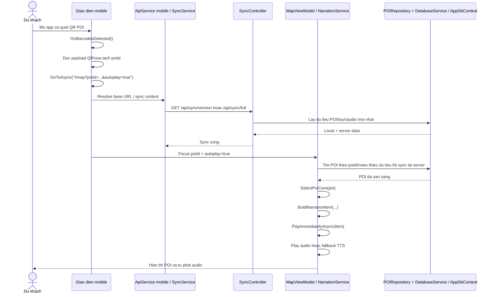
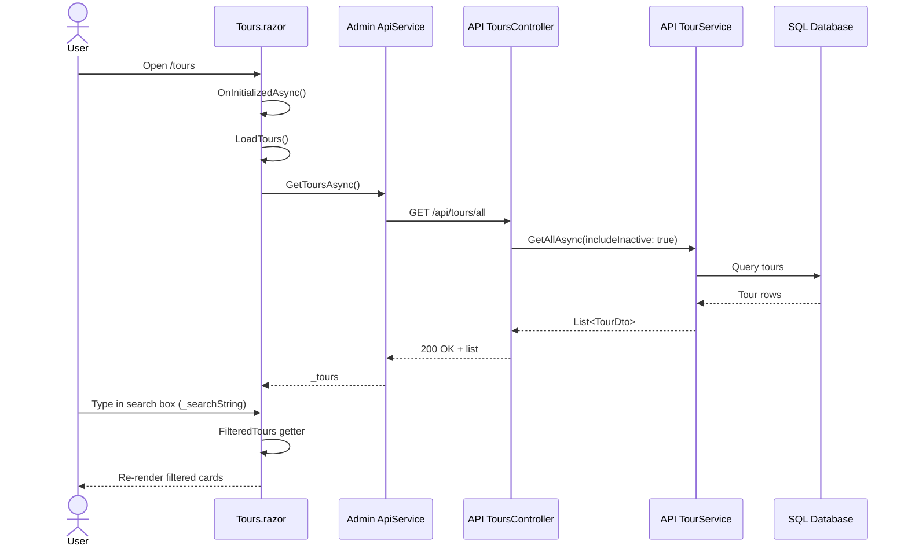
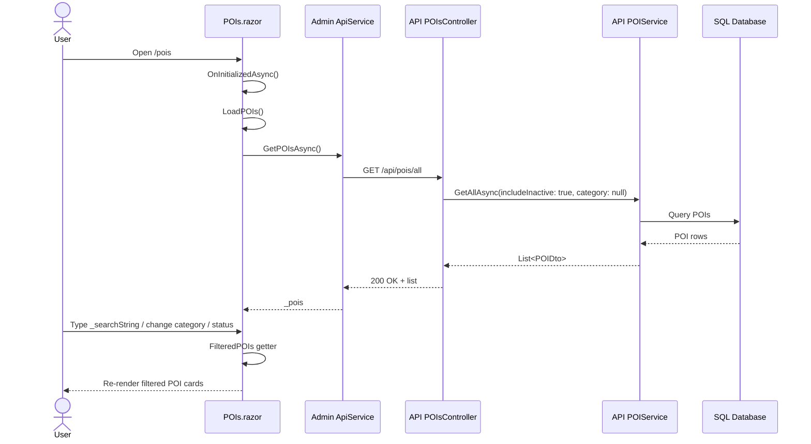
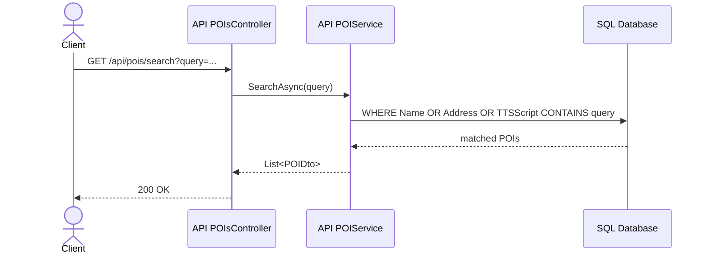
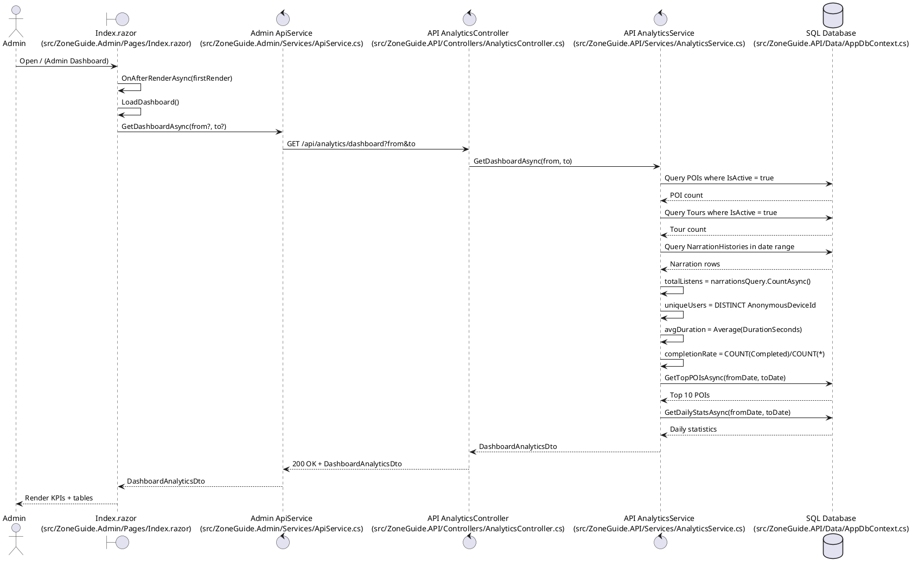
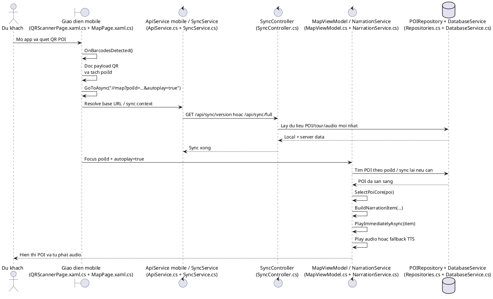

# Sequence Diagram -> Current Code Mapping

Tai lieu nay doi chieu cac sequence diagram trong anh voi code hien tai trong repository.

## Ket luan nhanh

- Hinh dashboard admin dung voi code hien tai khi gom dung 5 lifeline: `Admin` -> `Index.razor` -> `Admin ApiService` -> `API AnalyticsController` -> `API AnalyticsService` -> `SQL Database`.
- Hinh QR / autoplay POI dung voi code hien tai, nhung nen dat ten lifeline ro hon theo vai tro: `Du khach`, `Giao dien mobile`, `ApiService mobile / SyncService`, `SyncController`, `MapViewModel / NarrationService`, `POIRepository + DatabaseService / AppDbContext`.
- Hinh heatmap va hinh realtime tracking van dung ve mat nghiep vu, nhung la 2 luong rieng nen nen tach thanh 2 sequence diagram rieng.
- Hinh autoplay co 2 nguon kich hoat `PlayImmediatelyAsync`: autoplay tu QR va geofence enter.
- Hinh chon POI can ghi nhan scoring tong hop, khong chi la `Distance`.

## 1. Dashboard analytics (Admin)

```mermaid
sequenceDiagram
	actor Admin
	participant DashboardUI as Index.razor
	participant ApiService as Admin ApiService
	participant AnalyticsApi as API AnalyticsController
	participant AnalyticsService as API AnalyticsService
	database DB as SQL Database

	Admin->>DashboardUI: Open / (Admin Dashboard)
	DashboardUI->>DashboardUI: OnAfterRenderAsync(firstRender)
	DashboardUI->>DashboardUI: LoadDashboard()
	DashboardUI->>ApiService: GetDashboardAsync(from?, to?)
	ApiService->>AnalyticsApi: GET /api/analytics/dashboard?from&to
	AnalyticsApi->>AnalyticsService: GetDashboardAsync(from, to)
	AnalyticsService->>DB: Query POIs where IsActive = true
	DB-->>AnalyticsService: POI count
	AnalyticsService->>DB: Query Tours where IsActive = true
	DB-->>AnalyticsService: Tour count
	AnalyticsService->>DB: Query NarrationHistories in date range\n[StartTime >= from AND StartTime <= to]
	DB-->>AnalyticsService: Narration rows
	AnalyticsService->>AnalyticsService: totalListens = narrationsQuery.CountAsync()
	AnalyticsService->>AnalyticsService: uniqueUsers = DISTINCT AnonymousDeviceId
	AnalyticsService->>AnalyticsService: avgDuration = Average(DurationSeconds)
	AnalyticsService->>AnalyticsService: completionRate = COUNT(Completed)/COUNT(*)
	AnalyticsService->>AnalyticsService: GetTopPOIsAsync(fromDate, toDate)
	AnalyticsService->>DB: GROUP BY POIId, POIName\nORDER BY ListenCount DESC\nTAKE 10
	DB-->>AnalyticsService: Top 10 POIs
	AnalyticsService->>AnalyticsService: GetDailyStatsAsync(fromDate, toDate)
	AnalyticsService->>DB: GROUP BY StartTime.Date\nORDER BY Date
	DB-->>AnalyticsService: Daily statistics
	AnalyticsService-->>AnalyticsApi: DashboardAnalyticsDto
	AnalyticsApi-->>ApiService: 200 OK + DashboardAnalyticsDto
	ApiService-->>DashboardUI: DashboardAnalyticsDto
	DashboardUI-->>Admin: Render KPIs + tables
```

### Mapping file and methods

- UI render + fetch: `OnAfterRenderAsync(bool firstRender)` and `LoadDashboard()` in [src/ZoneGuide.Admin/Pages/Index.razor](../src/ZoneGuide.Admin/Pages/Index.razor)
- Admin API client: `GetDashboardAsync(DateTime? from = null, DateTime? to = null)` in [src/ZoneGuide.Admin/Services/ApiService.cs](../src/ZoneGuide.Admin/Services/ApiService.cs)
- API endpoint: `GetDashboard([FromQuery] DateTime? from = null, [FromQuery] DateTime? to = null)` in [src/ZoneGuide.API/Controllers/AnalyticsController.cs](../src/ZoneGuide.API/Controllers/AnalyticsController.cs)
- Service aggregation: `GetDashboardAsync(DateTime? from, DateTime? to)` in [src/ZoneGuide.API/Services/AnalyticsService.cs](../src/ZoneGuide.API/Services/AnalyticsService.cs)
- Source table: `NarrationHistories` via `DbSet<NarrationHistoryEntity>` in [src/ZoneGuide.API/Data/AppDbContext.cs](../src/ZoneGuide.API/Data/AppDbContext.cs)

### Ghi chu ve ky hieu

- `Index.razor` la giao dien dashboard admin, khong phai controller.
- `Admin ApiService` la hop dong API client o UI, khong phai service nghiep vu.
- `API AnalyticsController` la diem nhan request HTTP.
- `API AnalyticsService` la noi tinh KPI va tap hop du lieu.
- `SQL Database` la nguon du lieu thuc te cho KPI.

## 2. Quet QR POI va tu phat audio



### Mapping file and methods

- Quet QR va doc payload o [src/ZoneGuide.Mobile/Views/QRScannerPage.xaml.cs](../src/ZoneGuide.Mobile/Views/QRScannerPage.xaml.cs)
- Dieu huong sang map voi `poiId` va `autoplay=true` o [src/ZoneGuide.Mobile/Views/QRScannerPage.xaml.cs](../src/ZoneGuide.Mobile/Views/QRScannerPage.xaml.cs)
- `MapPage` doc query `poiId` o [src/ZoneGuide.Mobile/Views/MapPage.xaml.cs](../src/ZoneGuide.Mobile/Views/MapPage.xaml.cs)
- `MapPage` doc query `autoplay` o [src/ZoneGuide.Mobile/Views/MapPage.xaml.cs](../src/ZoneGuide.Mobile/Views/MapPage.xaml.cs)
- `MapViewModel` tim POI va co the sync lai server o [src/ZoneGuide.Mobile/ViewModels/MapViewModel.cs](../src/ZoneGuide.Mobile/ViewModels/MapViewModel.cs)
- `NarrationService` nhan item vao queue va phat ngay o [src/ZoneGuide.Mobile/Services/NarrationService.cs](../src/ZoneGuide.Mobile/Services/NarrationService.cs)

### Ghi chu ve ky hieu

- `Giao dien mobile` gom `QRScannerPage.xaml.cs` va `MapPage.xaml.cs`.
- `ApiService mobile / SyncService` la lop goi API va dong bo du lieu.
- `MapViewModel / NarrationService` la noi chon POI, tao narration va phat audio.
- `POIRepository + DatabaseService / AppDbContext` la tap hop nguon du lieu local + server.

## 3. Thong ke heatmap va tracking realtime (Admin)

### Heatmap

- `Heatmap.razor` goi `GetHeatmapDataAsync()` tai [src/ZoneGuide.Admin/Pages/Heatmap.razor](../src/ZoneGuide.Admin/Pages/Heatmap.razor#L188)
- `ApiService` goi API heatmap tai [src/ZoneGuide.Admin/Services/ApiService.cs](../src/ZoneGuide.Admin/Services/ApiService.cs#L412)
- `AnalyticsController` nhan request tai [src/ZoneGuide.API/Controllers/AnalyticsController.cs](../src/ZoneGuide.API/Controllers/AnalyticsController.cs#L87)
- `AnalyticsService` group du lieu tu `LocationHistories` thanh `HeatmapPointDto` tai [src/ZoneGuide.API/Services/AnalyticsService.cs](../src/ZoneGuide.API/Services/AnalyticsService.cs#L179)
- Y nghia: du lieu heatmap den tu lich su vi tri do mobile upload len API analytics.

### Realtime tracking

- `Index.razor` lay snapshot realtime tai [src/ZoneGuide.Admin/Pages/Index.razor](../src/ZoneGuide.Admin/Pages/Index.razor#L282)
- `ApiService` goi `GET api/mobile-monitoring/snapshot` tai [src/ZoneGuide.Admin/Services/ApiService.cs](../src/ZoneGuide.Admin/Services/ApiService.cs#L446)
- `MobileMonitoringController` tra snapshot tai [src/ZoneGuide.API/Controllers/MobileMonitoringController.cs](../src/ZoneGuide.API/Controllers/MobileMonitoringController.cs#L35)
- `MobileLiveMonitoringService` build snapshot tu `_sessions` tai [src/ZoneGuide.API/Services/MobileLiveMonitoringService.cs](../src/ZoneGuide.API/Services/MobileLiveMonitoringService.cs#L80)
- `MobileLiveMonitoringService` cap nhat session khi nhan heartbeat tai [src/ZoneGuide.API/Services/MobileLiveMonitoringService.cs](../src/ZoneGuide.API/Services/MobileLiveMonitoringService.cs#L49)
- `MobileLiveMonitoringService` broadcast thay doi qua SignalR tai [src/ZoneGuide.API/Services/MobileLiveMonitoringService.cs](../src/ZoneGuide.API/Services/MobileLiveMonitoringService.cs#L160)
- Mobile app bat dau gui heartbeat khi app mo tai [src/ZoneGuide.Mobile/App.xaml.cs](../src/ZoneGuide.Mobile/App.xaml.cs#L46) va [src/ZoneGuide.Mobile/Services/MobilePresenceService.cs](../src/ZoneGuide.Mobile/Services/MobilePresenceService.cs#L61)

## 4. Monitoring app mobile

- `App.xaml.cs` khong chi mo app ma con kick start tracking/heartbeat o [src/ZoneGuide.Mobile/App.xaml.cs](../src/ZoneGuide.Mobile/App.xaml.cs#L46)
- `MobilePresenceService` gui heartbeat dinh ky o [src/ZoneGuide.Mobile/Services/MobilePresenceService.cs](../src/ZoneGuide.Mobile/Services/MobilePresenceService.cs#L61)
- `MobilePresenceService` gui heartbeat ngay luc start o [src/ZoneGuide.Mobile/Services/MobilePresenceService.cs](../src/ZoneGuide.Mobile/Services/MobilePresenceService.cs#L69)
- `MobilePresenceService` xu ly truong hop tat app / offline o [src/ZoneGuide.Mobile/Services/MobilePresenceService.cs](../src/ZoneGuide.Mobile/Services/MobilePresenceService.cs#L116)
- `MobileMonitoringController` nhan heartbeat va snapshot o [src/ZoneGuide.API/Controllers/MobileMonitoringController.cs](../src/ZoneGuide.API/Controllers/MobileMonitoringController.cs#L13) va [src/ZoneGuide.API/Controllers/MobileMonitoringController.cs](../src/ZoneGuide.API/Controllers/MobileMonitoringController.cs#L35)
- `MobileLiveMonitoringService` cap nhat `_sessions` o [src/ZoneGuide.API/Services/MobileLiveMonitoringService.cs](../src/ZoneGuide.API/Services/MobileLiveMonitoringService.cs#L49) va xoa session o [src/ZoneGuide.API/Services/MobileLiveMonitoringService.cs](../src/ZoneGuide.API/Services/MobileLiveMonitoringService.cs#L85)

## 5. Xu ly khi 2 POI gan nhau

- `MapViewModel` day location update vao geofence service o [src/ZoneGuide.Mobile/ViewModels/MapViewModel.cs](../src/ZoneGuide.Mobile/ViewModels/MapViewModel.cs#L215)
- `GeofenceService` xu ly vi tri hien tai va sinh danh sach event o [src/ZoneGuide.Mobile/Services/GeofenceService.cs](../src/ZoneGuide.Mobile/Services/GeofenceService.cs#L127)
- `PoiScoringService` tinh `FinalPriority` o [src/ZoneGuide.Mobile/Services/PoiScoringService.cs](../src/ZoneGuide.Mobile/Services/PoiScoringService.cs#L10)
- Trong `ProcessLocationUpdateAsync()`, code chon 1 Enter tot nhat bang `OrderByDescending(FinalPriority).ThenBy(Distance)`.
- `MapViewModel` nhan `GeofenceTriggered` o [src/ZoneGuide.Mobile/ViewModels/MapViewModel.cs](../src/ZoneGuide.Mobile/ViewModels/MapViewModel.cs#L1319)
- `MapViewModel` goi `PlayImmediatelyAsync(BuildNarrationItem(...))` khi POI duoc chon o [src/ZoneGuide.Mobile/ViewModels/MapViewModel.cs](../src/ZoneGuide.Mobile/ViewModels/MapViewModel.cs#L1439)
- `NarrationService` bo qua trung lap POI dang phat/da co trong queue o [src/ZoneGuide.Mobile/Services/NarrationService.cs](../src/ZoneGuide.Mobile/Services/NarrationService.cs#L67)

## Ghi chu ve do khop voi anh

- Hinh 1 ve chuc nang la dung, nhung anh dang ghep 2 flow khac page: `Heatmap.razor` va `Index.razor`.
- Hinh 4 ve luong la dung, nhung `PlayImmediatelyAsync` co the den tu autoplay QR hoac geofence enter.
- Hinh 5 dung ve y tuong. Thuc te code hien tai khong so sanh chi `Distance`; no dung scoring tong hop de chon POI tot nhat.

## 6. Search sequence: Tour and POI (explicit file + method)

### 6.1 Tour search (Admin page, client-side filtering)



Main methods and files:
- UI load + search binding: `OnInitializedAsync()`, `LoadTours()`, `_searchString`, `FilteredTours` in [src/ZoneGuide.Admin/Pages/Tours.razor](../src/ZoneGuide.Admin/Pages/Tours.razor)
- Admin HTTP client: `GetToursAsync()` in [src/ZoneGuide.Admin/Services/ApiService.cs](../src/ZoneGuide.Admin/Services/ApiService.cs)
- API endpoint: `GetAllAdmin()` in [src/ZoneGuide.API/Controllers/ToursController.cs](../src/ZoneGuide.API/Controllers/ToursController.cs)
- Data query: `GetAllAsync(bool includeInactive = false)` in [src/ZoneGuide.API/Services/TourService.cs](../src/ZoneGuide.API/Services/TourService.cs)

Notes:
- Search itself is local (no extra API call per keystroke).
- Filtering fields: `Name`, `Description`, and status chip (`Dang bat`/`Da tat`).

### 6.2 POI search (Admin page, client-side filtering)



Main methods and files:
- UI load + search binding: `OnInitializedAsync()`, `LoadPOIs()`, `_searchString`, `_selectedCategory`, `_selectedStatus`, `FilteredPOIs` in [src/ZoneGuide.Admin/Pages/POIs.razor](../src/ZoneGuide.Admin/Pages/POIs.razor)
- Admin HTTP client: `GetPOIsAsync()` in [src/ZoneGuide.Admin/Services/ApiService.cs](../src/ZoneGuide.Admin/Services/ApiService.cs)
- API endpoint (all POIs for admin): `GetAllAdmin()` in [src/ZoneGuide.API/Controllers/POIsController.cs](../src/ZoneGuide.API/Controllers/POIsController.cs)
- Data query: `GetAllAsync(bool includeInactive = false, string? category = null)` in [src/ZoneGuide.API/Services/POIService.cs](../src/ZoneGuide.API/Services/POIService.cs)

Notes:
- Search itself is local (no extra API call per keystroke).
- Filtering fields: `Name`, `TTSScript`, `Address`, plus category and status.

### 6.3 Optional server-side POI search endpoint (exists in API)



Main methods and files:
- Endpoint: `Search([FromQuery] string query)` in [src/ZoneGuide.API/Controllers/POIsController.cs](../src/ZoneGuide.API/Controllers/POIsController.cs)
- Service method: `SearchAsync(string keyword)` in [src/ZoneGuide.API/Services/POIService.cs](../src/ZoneGuide.API/Services/POIService.cs)

Note:
- Current Admin pages are not using this endpoint for live typing search.

## 7. Dashboard KPI sequence: Tong luot nghe (Admin)

Main methods and files:
- UI render + fetch: `OnAfterRenderAsync(bool firstRender)` and `LoadDashboard()` in [src/ZoneGuide.Admin/Pages/Index.razor](../src/ZoneGuide.Admin/Pages/Index.razor)
- Admin API client: `GetDashboardAsync(DateTime? from = null, DateTime? to = null)` in [src/ZoneGuide.Admin/Services/ApiService.cs](../src/ZoneGuide.Admin/Services/ApiService.cs)
- API endpoint: `GetDashboard([FromQuery] DateTime? from = null, [FromQuery] DateTime? to = null)` in [src/ZoneGuide.API/Controllers/AnalyticsController.cs](../src/ZoneGuide.API/Controllers/AnalyticsController.cs)
- Service aggregation: `GetDashboardAsync(DateTime? from, DateTime? to)` in [src/ZoneGuide.API/Services/AnalyticsService.cs](../src/ZoneGuide.API/Services/AnalyticsService.cs)
- Source table: `NarrationHistories` via `DbSet<NarrationHistoryEntity>` in [src/ZoneGuide.API/Data/AppDbContext.cs](../src/ZoneGuide.API/Data/AppDbContext.cs)

Implementation detail of TotalListens:
- `totalListens` is calculated by `narrationsQuery.CountAsync()`.
- `narrationsQuery` filters `NarrationHistories` by time window:
	- `StartTime >= fromDate`
	- `StartTime <= toDate`

## 8. StarUML version

### 8.1 Dashboard analytics (Admin)

Use these elements in StarUML:

- Actors / Lifelines:
	- `Admin`
	- `Index.razor`
	- `Admin ApiService`
	- `API AnalyticsController`
	- `API AnalyticsService`
	- `SQL Database`

- Messages:
	1. `Admin` -> `Index.razor`: `Open / (Admin Dashboard)`
	2. `Index.razor` -> `Index.razor`: `OnAfterRenderAsync(firstRender)`
	3. `Index.razor` -> `Index.razor`: `LoadDashboard()`
	4. `Index.razor` -> `Admin ApiService`: `GetDashboardAsync(from?, to?)`
	5. `Admin ApiService` -> `API AnalyticsController`: `GET /api/analytics/dashboard?from&to`
	6. `API AnalyticsController` -> `API AnalyticsService`: `GetDashboardAsync(from, to)`
	7. `API AnalyticsService` -> `SQL Database`: `Query POIs where IsActive = true`
	8. `API AnalyticsService` -> `SQL Database`: `Query Tours where IsActive = true`
	9. `API AnalyticsService` -> `SQL Database`: `Query NarrationHistories in date range`
	10. `API AnalyticsService` -> `API AnalyticsService`: `Compute totalListens / uniqueUsers / avgDuration / completionRate`
	11. `API AnalyticsService` -> `SQL Database`: `GetTopPOIsAsync(fromDate, toDate)`
	12. `API AnalyticsService` -> `SQL Database`: `GetDailyStatsAsync(fromDate, toDate)`
	13. `API AnalyticsService` -> `API AnalyticsController`: `DashboardAnalyticsDto`
	14. `API AnalyticsController` -> `Admin ApiService`: `200 OK + DashboardAnalyticsDto`
	15. `Admin ApiService` -> `Index.razor`: `DashboardAnalyticsDto`
	16. `Index.razor` -> `Admin`: `Render KPIs + tables`

### 8.2 QR POI va tu phat audio

Use these elements in StarUML:

- Actors / Lifelines:
	- `Du khach`
	- `Giao dien mobile`
	- `ApiService mobile / SyncService`
	- `SyncController`
	- `MapViewModel / NarrationService`
	- `POIRepository + DatabaseService / AppDbContext`

- Messages:
	1. `Du khach` -> `Giao dien mobile`: `Mo app va quet QR POI`
	2. `Giao dien mobile` -> `Giao dien mobile`: `OnBarcodesDetected()`
	3. `Giao dien mobile` -> `Giao dien mobile`: `Doc payload QR va tach poiId`
	4. `Giao dien mobile` -> `Giao dien mobile`: `GoToAsync("//map?poiId=...&autoplay=true")`
	5. `Giao dien mobile` -> `ApiService mobile / SyncService`: `Resolve base URL / sync context`
	6. `ApiService mobile / SyncService` -> `SyncController`: `GET /api/sync/version hoac /api/sync/full`
	7. `SyncController` -> `POIRepository + DatabaseService / AppDbContext`: `Lay du lieu POI/tour/audio moi nhat`
	8. `POIRepository + DatabaseService / AppDbContext` -> `SyncController`: `Local + server data`
	9. `SyncController` -> `ApiService mobile / SyncService`: `Sync xong`
	10. `Giao dien mobile` -> `MapViewModel / NarrationService`: `Focus poiId + autoplay=true`
	11. `MapViewModel / NarrationService` -> `POIRepository + DatabaseService / AppDbContext`: `Tim POI theo poiId / sync lai neu can`
	12. `POIRepository + DatabaseService / AppDbContext` -> `MapViewModel / NarrationService`: `POI da san sang`
	13. `MapViewModel / NarrationService` -> `MapViewModel / NarrationService`: `SelectPoiCore(poi)`
	14. `MapViewModel / NarrationService` -> `MapViewModel / NarrationService`: `BuildNarrationItem(...)`
	15. `MapViewModel / NarrationService` -> `MapViewModel / NarrationService`: `PlayImmediatelyAsync(item)`
	16. `MapViewModel / NarrationService` -> `Du khach`: `Hien thi POI va tu phat audio`

### 8.3 Ghi chu ve StarUML

- Dung `Sequence Diagram` trong StarUML.
- Moi dong `Messages` tao thanh mot message tren diagram.
- Cac dong co prefix `->` la call message.
- Cac dong ben trong cung lifeline nhu `OnAfterRenderAsync(firstRender)` co the ve bang `self-message`.
- Neu muon diagram gon hon, co the gop `ApiService mobile / SyncService` thanh mot lifeline `Mobile ApiService`.

## 9. PlantUML version

### 9.1 Dashboard analytics (Admin)



### 9.2 QR POI va tu phat audio



### 9.3 Ghi chu

- PlantUML hop voi VS Code extension va co the render sang PNG/SVG de nhan vao bao cao.
- Neu ban muon, minh co the chuyen luon section 1/2 dang `mermaid` thanh PlantUML dong bo 100% voi file nay.
